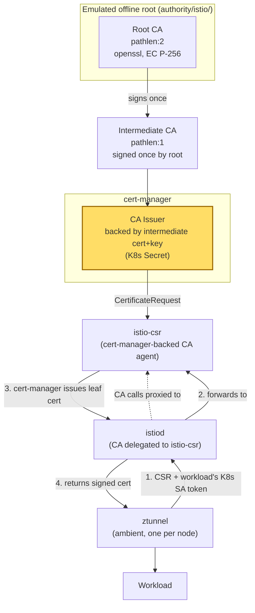
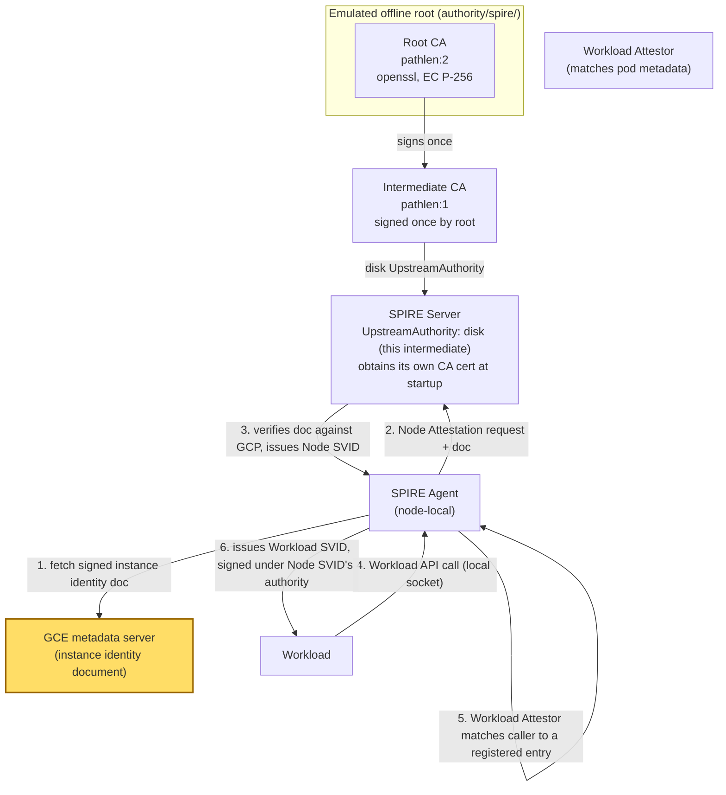

# Istio CSR vs. SPIRE — comparing two identity mechanisms

Status: **draft**. Source of truth for this repo — if `README.md`,
`instructions.md`, or either per-path `DESIGN.md` disagrees with this doc,
this doc wins and the other needs updating.

## Terminology first: these are not apples-to-apples

Before comparing mechanics, it matters that **Istio's CSR flow and SPIRE's
attestation model answer different questions**:

| | What it actually attests | Tiers |
|---|---|---|
| **Istio CSR flow** | "Is this *workload* allowed to speak for this K8s ServiceAccount?" — proven by a Kubernetes-issued, time-bounded, audience-scoped SA token. | One tier — per-workload only. There is no separate step that attests the *node* the workload happens to be running on. |
| **SPIRE** | Two separate questions: "Is this *node* the one it claims to be?" (Node Attestor, e.g. `gcp_iit` verifying GCE instance-identity evidence), then "Is this *thing running on an already-attested node* the workload it claims to be?" (Workload Attestor, e.g. matching the calling process's K8s pod metadata). | Two tiers — node, then workload, with the node tier being a real trust decision independent of the workload tier. |

Calling Istio's CSR flow "node attestation" is a category error — it's
useful to compare the two because they solve overlapping problems
(getting a workload a cryptographic identity it can use for mTLS), but
only SPIRE has a genuine node-identity tier. This repo's name
(`mesh-node-attestation`) is really shorthand for "how do these two mesh
identity systems establish trust," not a claim that both do literal node
attestation.

## Path 1 — Istio CSR flow (via cert-manager `istio-csr`)

This repo's demo targets **ambient mode** exclusively — ztunnel, one
per-node proxy handling mTLS for every workload on that node. See
[../../istio-csr/README.md](../../istio-csr/README.md).



**Sequence, in words:**

1. ztunnel generates a private key + CSR on behalf of a workload identity
   it's proxying for.
2. It authenticates to `istio-csr` using **its own** Kubernetes
   ServiceAccount token — not the workload's. Because ztunnel isn't
   colocated inside each workload's pod filesystem, it can't read that
   workload's mounted token directly. Instead it asks to **impersonate**
   the target workload's SPIFFE identity in the CSR request metadata.
   `istio-csr` only allows this if ztunnel's own ServiceAccount is on an
   explicit allowlist (`--ca-trusted-node-accounts`, e.g.
   `istio-system/ztunnel`) **and** an independent, live check confirms a
   pod with the requested identity is actually scheduled on ztunnel's own
   node — see "Real code" below, this is confirmed from `istio-csr`'s own
   source, not assumed.
3. istiod forwards the (now-authorized) CSR to `istio-csr`, which creates
   a cert-manager `CertificateRequest` against the `CA` Issuer.
4. cert-manager signs it using the Issuer's intermediate key (our emulated
   `authority/istio/intermediate.key`), returns the leaf cert.
5. ztunnel gets back a cert chaining `leaf -> intermediate -> root` and
   uses it for mTLS.

**What's actually being trusted here**: two things stacked — the K8s API
server's ability to correctly bind ztunnel's *own* ServiceAccount token to
it, and a live Kubernetes-informer-backed check that the impersonated
identity is genuinely running on ztunnel's node right now (not a static
claim). This is a real, bounded mechanism — explicitly modeled on
Kubernetes' own [Node
Authorization](https://kubernetes.io/docs/reference/access-authn-authz/node/)
— but it's still not an independent cryptographic attestation of the
*node itself* the way SPIRE's `gcp_iit` is: it trusts the K8s scheduler's
pod-to-node placement record, not a signed hardware/hypervisor-backed
credential. A compromised ztunnel is bounded to impersonating identities
of pods **the K8s API currently reports as colocated on its node** — a
real constraint, but one that rests on the K8s control plane being
honest, whereas SPIRE's node evidence doesn't.

**Rotation**: SA tokens are short-lived and auto-rotated by the kubelet;
ztunnel re-requests a new leaf cert on its own schedule (default ~24h
lifetime, refreshed well before expiry). No node-level identity to
rotate — there isn't one.

**Authority in this repo**: cert-manager's plain `CA` Issuer type, backed
by `authority/istio/intermediate-ca.crt` + `.key` as a K8s Secret — not
GCP CAS. `istio-csr` talks to whatever Issuer/ClusterIssuer cert-manager
is configured with; swapping in a real CA later (GCP CAS via
`cert-manager-google-cas-issuer`, Vault, etc.) only changes the Issuer
manifest, not `istio-csr` itself. See
[istio-csr/DESIGN.md](istio-csr/DESIGN.md).

**Real code**: `istio-csr`'s impersonation branch, from
[`pkg/server/auth.go`](https://github.com/cert-manager/istio-csr/blob/main/pkg/server/auth.go)
(Apache 2.0, trimmed):

```go
crMetadata := icr.GetMetadata().GetFields()
impersonatedIdentity := crMetadata[security.ImpersonatedIdentity].GetStringValue()
if impersonatedIdentity != "" {
    if s.nodeAuthorizer == nil {
        log.Warnf("impersonation not allowed, as node authorizer (CA_TRUSTED_NODE_ACCOUNTS) is not configured")
        return "", false
    }
    if err := s.nodeAuthorizer.authenticateImpersonation(caller.KubernetesInfo, impersonatedIdentity); err != nil {
        return identities, false
    }
    identities = impersonatedIdentity
}
```

and the node-colocation check itself, from
[`pkg/server/node_auth.go`](https://github.com/cert-manager/istio-csr/blob/main/pkg/server/node_auth.go)
(Apache 2.0, trimmed — full version does a couple more sanity checks
before this):

```go
// First, make sure the caller is allowed to impersonate, in general
if _, f := na.trustedNodeAccounts[callerSa]; !f {
    return fmt.Errorf("caller (%v) is not allowed to impersonate", caller)
}
// ...
// We want to find out if there is any pod running with the requested
// identity on the callers node. The indexer (previously setup) creates a
// lookup table for a {Node, SA} pair, which we can lookup
k := ca.SaNode{
    ServiceAccount: types.NamespacedName{Name: requestedIdentity.ServiceAccount, Namespace: requestedIdentity.Namespace},
    Node:           callerPod.Spec.NodeName,
}
res := na.nodeIndex.Lookup(k)
if len(res) == 0 {
    return fmt.Errorf("no instances of %q found on node %q", k.ServiceAccount, k.Node)
}
```

`nodeIndex` is a live Kubernetes informer index over Pods, keyed by
`{ServiceAccount, Node}` — this is a real-time query against current
cluster state, not a cached or static claim. `istio-csr`'s own comment
credits this as a port of
[Istio's own node-auth implementation](https://github.com/istio/istio/blob/1.22.1/security/pkg/server/ca/node_auth.go#L74).
This is what our `istio-csr/istio-csr/values.yaml` configures via
`app.server.caTrustedNodeAccounts: "istio-system/ztunnel"` — without it,
`istio-csr` rejects every cert request ztunnel makes on behalf of a
workload (confirmed in `istio-csr`'s own README, not just inferred).

## Path 2 — SPIRE (node attestor `gcp_iit`)



**Sequence, in words:**

1. SPIRE Server starts up and requests its own CA certificate from the
   `disk` UpstreamAuthority — i.e. from our emulated intermediate
   (`authority/spire/chain.pem` + `.key`). This makes SPIRE Server itself
   a subordinate CA, `root -> intermediate -> SPIRE Server CA -> leaf`.
2. SPIRE Agent (running on each node) fetches a **GCE-signed instance
   identity document** from the local metadata server — this is evidence
   only the real node's kernel/metadata endpoint can produce, not
   something a workload running on it could fake.
3. Agent presents that document to SPIRE Server as its Node Attestation
   evidence. Server independently verifies the document's signature
   against Google's public keys and checks the claimed instance against
   the GCE API. If valid, Server issues a **Node SVID** to the Agent.
4. Only after the Agent holds a valid Node SVID can it serve the
   **Workload API** to things running on that node. A workload connects
   over a local Unix socket; the Agent's **Workload Attestor** inspects
   the calling process (cgroup/PID -> K8s pod metadata) and matches it
   against registered entries.
5. If matched, the Agent issues a **Workload SVID**, cryptographically
   chained under the Node SVID it was issued — i.e. the workload's
   identity is only as trustworthy as the node-attestation step that
   preceded it.

**What's actually being trusted here**: GCE's metadata server and its
signed instance-identity document — a genuinely independent, node-scoped
credential the workload itself cannot produce. This is the real
distinction from Path 1: there's a dedicated trust decision *about the
node*, made before any workload identity is issued at all.

**Rotation**: Node SVIDs and Workload SVIDs both have configurable
(typically short) TTLs and are auto-rotated by the Agent well before
expiry, same operational shape as ztunnel's cert refresh in Path 1 — the
difference is upstream of that, in what evidence backs the *first* SVID
the Agent itself gets.

**Why `gcp_iit` specifically (not `k8s_psat`)**: it's the node attestor
that most clearly demonstrates SPIRE's node tier being independent of
Kubernetes —
`k8s_psat` (Kubernetes-issued node tokens) would blur the comparison back
toward "trusting the K8s control plane," similar in spirit to what Path 1
already does. The tradeoff: `gcp_iit` requires a real GCE/GKE environment
to exercise — see [spire/README.md](../spire/README.md).

**Authority in this repo**: SPIRE Server's `UpstreamAuthority "disk"`
plugin, pointed at `authority/spire/chain.pem` + `.key` — not the
`gcp_cas` UpstreamAuthority plugin a production deployment would more
likely use to talk to a real GCP CAS pool. See
[spire/DESIGN.md](spire/DESIGN.md).

**Real code**: the Agent-side fetch of the GCE instance identity document,
from
[`pkg/agent/plugin/nodeattestor/gcpiit/iit.go`](https://github.com/spiffe/spire/blob/main/pkg/agent/plugin/nodeattestor/gcpiit/iit.go)
(Apache 2.0, trimmed):

```go
const (
    defaultIdentityTokenHost     = "metadata.google.internal"
    identityTokenURLPathTemplate = "/computeMetadata/v1/instance/service-accounts/%s/identity"
    identityTokenAudience        = "spire-gcp-node-attestor"
)

func retrieveInstanceIdentityToken(url string) ([]byte, error) {
    req, _ := http.NewRequest("GET", url, nil)
    req.Header.Set("Metadata-Flavor", "Google")  // required by GCE's metadata server
    resp, err := (&http.Client{}).Do(req)
    // ...
    return io.ReadAll(resp.Body)
}
```

Nothing here proves a workload couldn't call this same URL — the
metadata server will answer any local caller. What actually makes this
unforgeable happens on the **verify** side, in
[`pkg/server/plugin/nodeattestor/gcpiit/iit.go`](https://github.com/spiffe/spire/blob/main/pkg/server/plugin/nodeattestor/gcpiit/iit.go)
(Apache 2.0, trimmed):

```go
// Per GCP documentation, IITs are always signed using the RS256 signature algorithm
var allowedJWTSignatureAlgorithms = []jose.SignatureAlgorithm{jose.RS256}

func validateAttestationAndExtractIdentityMetadata(stream nodeattestorv1.NodeAttestor_AttestServer, jwks *jose.JSONWebKeySet) (gcp.IdentityToken, error) {
    // ...
    token, err := jwt.ParseSigned(string(payload), allowedJWTSignatureAlgorithms)
    identityToken := gcp.IdentityToken{}
    if err := token.Claims(jwks, &identityToken); err != nil {
        return gcp.IdentityToken{}, status.Errorf(codes.InvalidArgument, "failed to validate the identity token signature: %v", err)
    }
    return identityToken, identityToken.Validate(jwt.Expected{AnyAudience: []string{tokenAudience}, Time: time.Now()})
}

// in Attest():
if !slices.Contains(c.ProjectIDAllowList, computeEngineMetadata.ProjectID) {
    return status.Errorf(codes.PermissionDenied, "identity token project ID %q is not in the allow list", computeEngineMetadata.ProjectID)
}
```

`jwks` here is Google's own public keys
([`google_public_key_retriever.go`](https://github.com/spiffe/spire/blob/main/pkg/server/plugin/nodeattestor/gcpiit/google_public_key_retriever.go),
fetched from `https://www.googleapis.com/oauth2/v1/certs`) — SPIRE Server
verifies the JWT signature against **Google's** key, not anything the
node or workload controls. This is the actual cryptographic root of trust
behind "the metadata server's word is unforgeable": only Google's private
key could have produced a signature that verifies against Google's public
key, and only the real hypervisor-backed metadata endpoint will hand that
signed document to a caller on that specific instance. Contrast with
Path 1's node-colocation check above, which trusts the K8s API's
bookkeeping rather than a signature chain rooted outside the cluster.

## Side-by-side comparison

| | Istio CSR (istio-csr) | SPIRE (`gcp_iit`) |
|---|---|---|
| What's attested | Workload only (via K8s SA token) | Node (GCE instance identity), then workload (process/pod metadata) |
| Node-level trust decision | None | Explicit, independent step (Node Attestor) |
| Identity issued by | cert-manager `CA` Issuer, via istio-csr | SPIRE Server, itself a subordinate CA under the emulated intermediate |
| Evidence workload can't forge | K8s API-bound SA token (kubelet-mediated) | GCE-signed instance identity document (kernel/metadata-mediated) |
| Blast radius of a compromised kubelet/node | Full — kubelet mediates SA token issuance for everything scheduled on it | Partial — a compromised node can still get a Node SVID (it *is* that node), but workload identity issuance is a separate local Workload Attestor decision, and cross-node impersonation isn't possible without also compromising GCE's metadata trust |
| Rotation | SA token (kubelet-managed) + leaf cert (ztunnel-managed) | Node SVID + Workload SVID (Agent-managed) |
| Portable off the target cloud | Yes — SA-token trust is Kubernetes-native, cloud-agnostic | No, as configured here — `gcp_iit` is GCP-specific; `k8s_psat`/`aws_iid`/etc. are the portable alternatives |
| Runs on local kind for this repo's demo | Yes | No — `gcp_iit` needs real GCE metadata, see `spire/README.md` |

## Open questions

- Whether to add a `k8s_psat` variant of the SPIRE path later, purely to
  make the "portable off GCP" row of the comparison table demonstrable
  end-to-end on kind, without displacing `gcp_iit` as the primary
  documented path.
- Whether `istio-csr`'s node-colocation check (Path 1's "Real code")
  degrades gracefully or fails closed if the Pod informer hasn't finished
  its initial sync yet on istio-csr startup — not yet verified against a
  running install.
